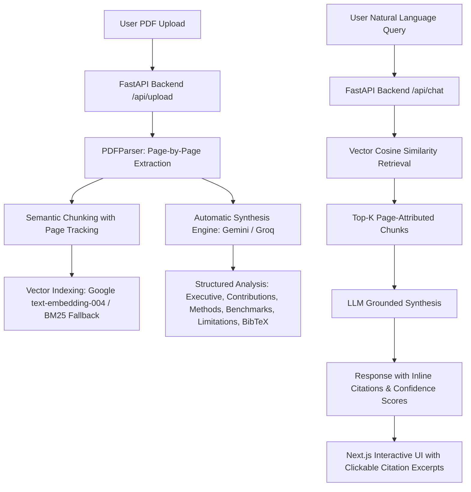

# 🔬 PaperScope AI — Enterprise Academic Research Paper Analyser (v2.0)

[](https://nextjs.org/)
[](https://fastapi.tiangolo.com/)
[](https://ai.google.dev/)
[](https://groq.com/)
[](LICENSE)

An enterprise-grade, full-stack Retrieval-Augmented Generation (RAG) platform purpose-built for academic literature analysis, research synthesis, and verifiable document interrogation.

---

## ✨ What's New in v2.0 vs v1.0

| Feature | Legacy v1.0 (Streamlit) | PaperScope AI v2.0 (Full-Stack) |
|---|---|---|
| **Architecture** | Monolithic single-script Streamlit | Decoupled Next.js 15 App Router + High-Performance FastAPI |
| **Conversational Memory** | Single question-response state | Multi-turn conversational context with citation memory |
| **Citation Attribution** | Raw text chunk dump | Interactive inline `[Page X]` chips with excerpt verification drawers |
| **Paper Breakdown** | Basic similarity dump | Automatic 5-part synthesis (Executive Summary, Contributions, Methodology, Benchmarks, Limitations) |
| **BibTeX Generator** | ❌ None | ✅ One-click copyable BibTeX citation generator |
| **Model Flexibility** | Hardcoded model | Multi-model switcher: Gemini 1.5 Flash, 1.5 Pro, 2.0 Flash & Groq Llama 3.3 70B |
| **API Configuration** | Streamlit secrets only | In-browser UI key storage or server environment variables |
| **Export Capabilities** | ❌ None | ✅ Download comprehensive Markdown reports with QA transcripts |
| **Design System** | Default Streamlit UI | Obsidian glassmorphic dark theme, responsive grid & micro-animations |

---

## 🏗️ System Architecture



---

## 🚀 Quick Start

### Prerequisites
- **Node.js**: v18+ (tested on Node.js v24)
- **Python**: 3.9+ (tested on Python 3.13)
- **API Keys (Optional on launch)**: [Google AI Studio (Gemini)](https://aistudio.google.com/app/apikey) or [Groq Console](https://console.groq.com/keys). Keys can be entered directly into the web UI!

---

### 1. Backend Setup (FastAPI)

```bash
cd backend

# Install dependencies
python -m pip install -r requirements.txt

# (Optional) Copy environment template
cp .env.example .env

# Run FastAPI dev server (port 8000)
python main.py
```

The API documentation will be live at `http://localhost:8000/docs`.

---

### 2. Frontend Setup (Next.js)

```bash
cd frontend

# Install dependencies
npm install

# Start Next.js development server (port 3000)
npm run dev
```

Open your browser at `http://localhost:3000`.

---

### 3. Or Run with Docker Compose

Run the entire full-stack stack with a single command:

```bash
docker compose up --build
```

---

## 🌐 Cloud Deployment Guide

### Deploying Frontend to Vercel
1. Push this repository to GitHub.
2. Go to [Vercel](https://vercel.com) and click **"Add New Project"**.
3. Select your repository and specify `Root Directory: frontend`.
4. Add environment variable:
   - `NEXT_PUBLIC_API_URL`: URL of your deployed backend service (e.g. `https://your-api.onrender.com`).
5. Click **Deploy**.

### Deploying Backend to Render / Railway
1. In Render, select **"New Web Service"** and connect your GitHub repo.
2. Set `Root Directory: backend`.
3. Set **Runtime**: `Python 3`.
4. Set **Build Command**: `pip install -r requirements.txt`.
5. Set **Start Command**: `uvicorn main:app --host 0.0.0.0 --port $PORT`.
6. Add environment variables:
   - `GOOGLE_API_KEY`: Your Gemini API key.
   - `GROQ_API_KEY`: Your Groq API key (optional).

---

## 📄 License

This project is licensed under the MIT License — see the [LICENSE](LICENSE) file for details.
